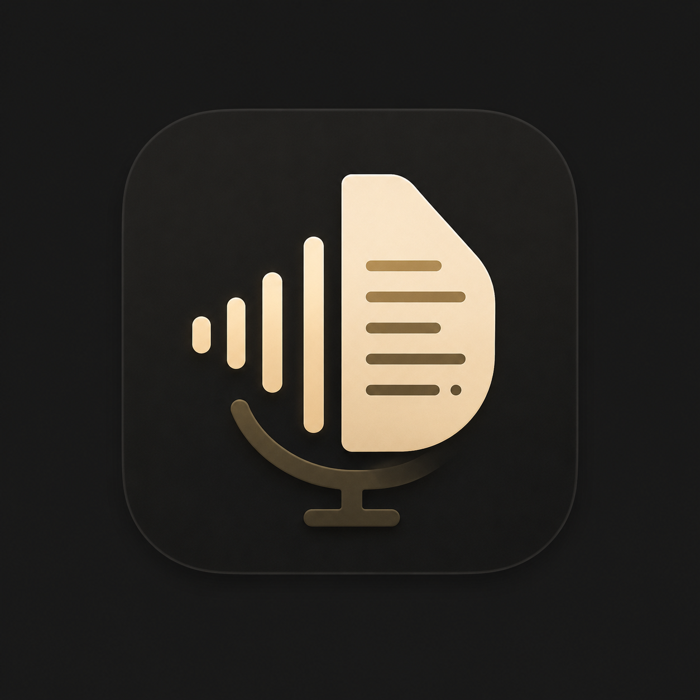

<div align="center">



# Your Call AI

**Local-first meeting notetaker for macOS & Windows.**

Records your screen and meeting audio, transcribes it, resolves who said what, writes an AI summary, and sends it to Slack or GetOverview — with your recordings staying on your own machine.

[](#install)
[](https://www.electronjs.org/)
[](https://github.com/spread-the-rumor/YourCallAI/releases)
[](LICENSE)

</div>

---

## What it does

- 🎙️ **Records** screen + meeting audio locally.
- ✍️ **Transcribes** with [Deepgram](https://deepgram.com/), then resolves speaker names.
- 🧠 **Summarizes** each meeting with an LLM.
- 📤 **Shares** the summary to **Slack** (as yourself, via per-user OAuth) or **GetOverview**.
- 🔒 **Keeps recordings on your machine** — only meeting metadata and transcripts sync per user.
- 🔑 **Holds no API keys in the app.** Every third-party secret lives on a serverless backend; the desktop app only talks to proxy routes.

## How it works

Your Call AI is an [Electron](https://www.electronjs.org/) desktop app paired with a thin serverless backend.

```
┌─────────────────────┐        proxy routes         ┌──────────────────────────┐
│   Electron app      │  ───────────────────────▶   │   Vercel backend (api/)  │
│   (src/)            │   no secrets on client      │   injects secrets server-  │
│                     │                             │   side: Deepgram, LLM,    │
│   • records local   │  ◀───────────────────────   │   Slack, GetOverview      │
│   • local storage   │        results              └──────────────────────────┘
└──────────┬──────────┘
           │  Google SSO + per-user sync
           ▼
      ┌──────────┐
      │ Supabase │   auth + meeting metadata/transcript sync (last-write-wins)
      └──────────┘
```

- **The app holds no API keys.** All third-party secrets live on the Vercel serverless backend (base `https://your-call-ai.vercel.app`). The client calls proxy routes and the backend injects the secret server-side.
- **Supabase** provides Google SSO and per-user meeting sync.
- **Recordings never leave your machine.** Only meeting metadata and transcripts sync, per user.

## Integrations

### Slack (per-user OAuth)

Each user connects their own workspace and posts **as themselves** — no shared bot token. The real Slack token never rides the deep link (only a single-use, 120-second one-time code does), CSRF is guarded with a random `state`, and the token is stored locally and never synced.

- Send summaries to **channels or people** (DMs) from the meeting Slack panel.
- Supports **external / Slack Connect** channels and DM contacts.

### GetOverview

Push meeting summaries straight to GetOverview.

## Install

Download the latest installer for your platform from the [**Releases**](https://github.com/spread-the-rumor/YourCallAI/releases) page:

- **Windows** — `.exe` (Squirrel) installer
- **macOS** — `.dmg`

## Development

```bash
npm install
npm start          # electron-forge dev
```

> **Note:** Main-process changes require a **full restart** — kill every `electron.exe` / Electron process and relaunch. If the bundle looks stale, delete `.webpack/` for a clean rebuild.

### Configuration

Development secrets live in a gitignored `.env` at the project root (Supabase URL/anon key, Slack client ID, proxy token, and dev-only transcription/AI keys). Values resolve at access time in the order **build-time bake → `process.env` → `.env`**.

See [`CLAUDE.md`](CLAUDE.md) for the full config/secrets map, backend route reference, and Slack app setup.

## Release

Releases are cut with a single command:

```bash
npm run ship -- "<message>" <patch|minor|major>
```

This commits, bumps the version, tags `vX.Y.Z`, and pushes — which triggers [`.github/workflows/release.yml`](.github/workflows/release.yml) to build the Windows + macOS installers into a **draft** GitHub Release and deploy the API to Vercel. Publish the draft manually once the build is green:

```bash
gh release edit vX.Y.Z --draft=false
```

## Project layout

| Path | What lives there |
|---|---|
| `src/main.js` | Electron main process — IPC handlers, deep-link routing, app lifecycle |
| `src/preload.js` | `contextBridge` `window.api` |
| `src/proxy.js` | `PROXY_URL` + `proxyPost()`; resolves build/env/`.env` values |
| `src/settingsStore.js` | Local prefs + feature flags |
| `src/integrations/` | Slack + GetOverview clients |
| `src/renderer/` | UI (`index.html`, `renderer.js`, `styles.css`) |
| `api/` | Vercel serverless backend (proxy routes, OAuth, config) |

## License

[MIT](LICENSE) © Rumor Avenue
